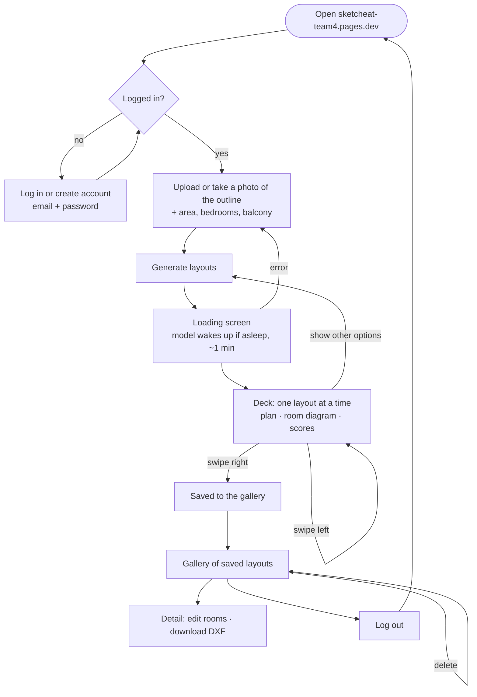

# 2 · User flow: Sketcheat (Team 4)

```mermaid
flowchart TD
  S([Open sketcheat-team4.pages.dev]) --> L{Logged in?}
  L -- no --> P[Log in or create account<br/>email + password] --> L
  L -- yes --> F[Upload or take a photo of the outline<br/>+ area, bedrooms, balcony]
  F --> G[Generate layouts]
  G --> W[Loading screen<br/>model wakes up if asleep, ~1 min]
  W -->|error| F
  W --> D[Deck: one layout at a time<br/>plan · room diagram · scores]
  D -->|swipe left| D
  D -->|swipe right| SV[Saved to the gallery]
  D -->|show other options| G
  SV --> GA[Gallery of saved layouts]
  GA --> DT[Detail: edit rooms · download DXF]
  GA -->|delete| GA
  GA --> O[Log out] --> S
```
