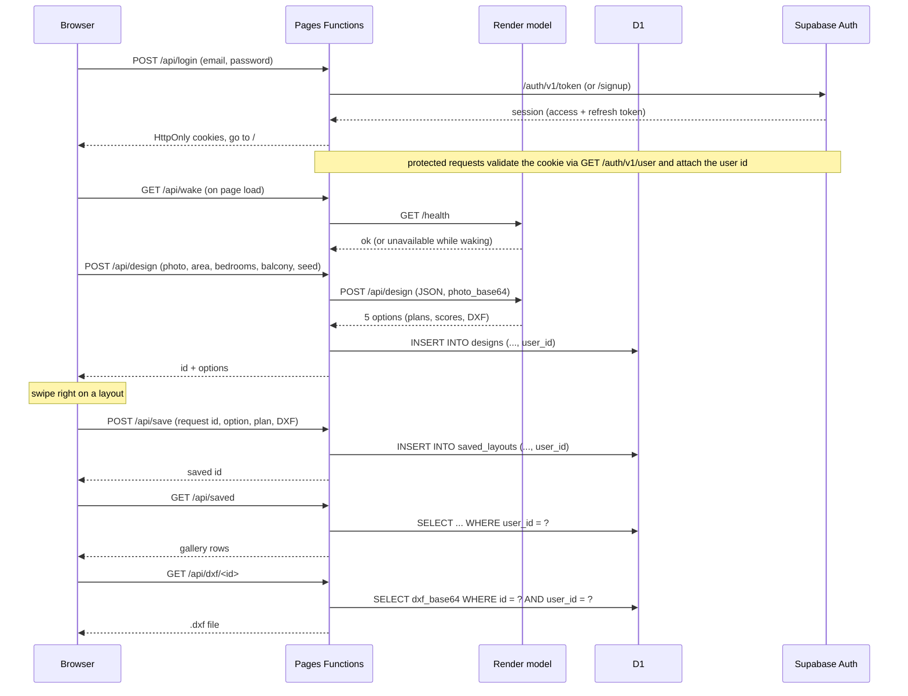

# 3 · Sequence: make and save a layout

```mermaid
sequenceDiagram
  participant B as Browser
  participant W as Pages Functions
  participant R as Render model
  participant D as D1
  participant S as Supabase Auth
  B->>W: POST /api/login (email, password)
  W->>S: /auth/v1/token (or /signup)
  S-->>W: session (access + refresh token)
  W-->>B: HttpOnly cookies, go to /
  Note over W,S: protected requests validate the cookie via GET /auth/v1/user and attach the user id
  B->>W: GET /api/wake (on page load)
  W->>R: GET /health
  R-->>W: ok (or unavailable while waking)
  B->>W: POST /api/design (photo, area, bedrooms, balcony, seed)
  W->>R: POST /api/design (JSON, photo_base64)
  R-->>W: 5 options (plans, scores, DXF)
  W->>D: INSERT INTO designs (..., user_id)
  W-->>B: id + options
  Note over B: swipe right on a layout
  B->>W: POST /api/save (request id, option, plan, DXF)
  W->>D: INSERT INTO saved_layouts (..., user_id)
  W-->>B: saved id
  B->>W: GET /api/saved
  W->>D: SELECT ... WHERE user_id = ?
  W-->>B: gallery rows
  B->>W: GET /api/dxf/<id>
  W->>D: SELECT dxf_base64 WHERE id = ? AND user_id = ?
  W-->>B: .dxf file
```

If Render is asleep, `/api/design` answers `503 {waking: true}` and the page retries every 15 s.
